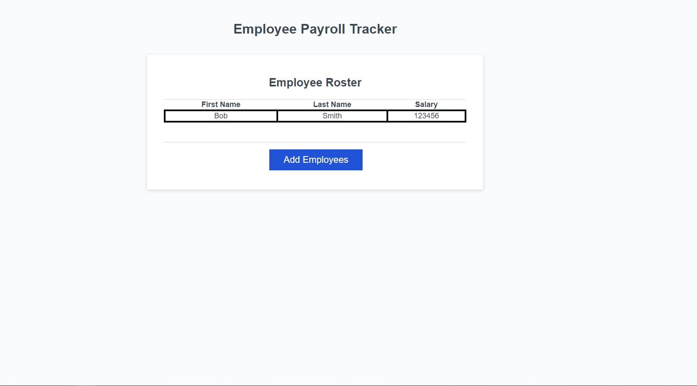

# Employee Payroll-Tracker

Week 3 Challenge - Create an employee payroll tracker using JavaScript.

## Description

The purpose of this project was to create a payroll tracking program that allowed for individual employee input. I created this project to further understand and implement JavaScript in a realistic application. Through this project I have learned a method of generating a random number within an index and using that to pull informaiton from said index. I have also gained considerable comfortability with While and For loops as well as concatting within a console log.

## Table of Contents

- [Original Code](#original-code)
- [Code Source](#code-source-within-this-repo)
- [Usage](#usage)
- [Credits](#credits)
- [License](#license)

## Original Code

The original, unedited code for this project can be found [HERE](https://git.bootcampcontent.com/University-of-Richmond/UR-VIRT-FSF-PT-02-2024-U-LOLC/-/tree/main/03-JavaScript/02-Challenge?ref_type=heads)

## Code Source Within This Repo

The HTML code within this repo can be found at [./index.html](index.html)

The JavaScript can be found at [./assets/script.js](./assets/script.js)

## Usage

The live deployment of this project can be found at [https://h-lane.github.io/payroll-tracker/](https://h-lane.github.io/payroll-tracker/)

## Credits

- University of Richmond Coding Bootcamp
- README Template provided by [The Coding Bootcamp Github](https://coding-boot-camp.github.io/full-stack/github/professional-readme-guide)
- HTML Assistance provided by [The Coding Bootcamp Github](https://coding-boot-camp.github.io/full-stack/html/html-cheatsheet)
- Markdown Syntax assistance provided by [Github Docs](https://docs.github.com/en/get-started/writing-on-github/getting-started-with-writing-and-formatting-on-github/basic-writing-and-formatting-syntax#section-links)

## License

This project has no license and is openly available.
